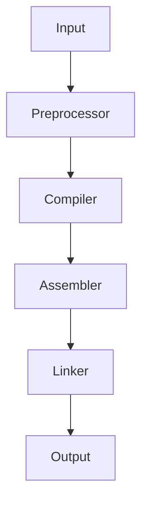

# Experiment : HOW Fast Would You Count Up? 
## Problem
How many times your TM (your personal Computer) can 
count up, starting from 0, in a limited time (Assume for 1 Second)?

## Answer
The 'main' executable counts approximately 600 million times
in a 2nd thread! (1st thread is the Main thread):

"TM main counts 600000000 times in 1.0003 second!"
##### Note0: Human being can count up, up to 10 in the same amount of time(1 Second)!    

## Instruction to run the program
`$ g++ main.cpp -o main -pthread -std=c++14`

`$ ./main`

  

## Compilation Process
#### Compilation flow chart:

Where, Input is `main.cpp`, a source code file. 

And Output is `main`, a binary executable file.
### Source Code (or Input)

`main.cpp`

`$ ls -l main.cpp`

Size: 894

Written by "amirmasp".

 Note1: counter.cpp code is embedded into main.cpp source code. 

### Preprocessor

A Preprocessor function Transforms the source code `main.cpp` into a preprocessed code `main.i`.

`$ g++ -E main.cpp > main.i`

This file is much larger than the source code file.

`$ ls -l main.i`

Size: 999555

### Compiler

A Compiler does Transform the preprocessed code`main.i`to an assembly code `main.s`.

`$ g++ -S main.cpp`

`$ ls -l main.s` 

Size: 106544

### Assembler

### Linker

   main.cpp: The Source code       
    
|                |
|  Preprocessor  |    $ g++ -E main.cpp > main.i 
|  (precompiler) |    
|________________|      
        |
        |
       \|/
        |
      main.i   // The preprocessed code
        |      // $ ls -l main.i
        |      size: 999555
       \|/
        |
__________________
|                |
|   Compiler     |    $ g++ -S main.cpp  
|                |  
|________________|

        |
        |
       \|/
        |
      main.s   // 
        |      // $ 
        |      size: 106546
       \|/
        |
__________________
|                |
|   Assembler    |   // $ g++ -C main.cpp  
|                |  // Note2: In our experiment we use <thread> library, so use this command:
|________________|  //$ g++ -C main.cpp -pthread -std=c++14

        |
        |
       \|/
        |
      a.out   // Object code (the machine code, binary code)
        |     // ls -l a.out
        |     size: 36464
       \|/
        |
__________________
|                |
|     Linker     |    // The Linker links source files and libraries
|                |    // and produces final executable file, main. 
|________________|

        |
        |
       \|/
        |
      main     // The Executable (The Runnable File)
               // $ ls -l main
               size: 36672 
