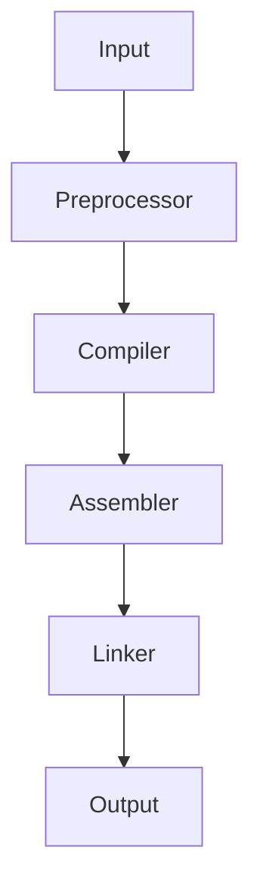

# Experiment : HOW fast can you count upward, start from zero in a limited time? 
## Problem
How many times your TM (your personal Computer) can 
count upward, start from 0, in a limited time (Assume for 1 Second)?

## Answer
The `main.exe` is a program (TM) that counts approximately 600 million times
in a 2nd thread! (1st thread is the Main thread):

"TM main counts 600000000 times in 1.0003 second!"
##### Note0: Human being can count up to 7 in the same amount of time(1 Second)!    
##### Note1: Machines are much stronger than us because they live in different time scal than us. 
1 second in our worl Is perceived 10 nano second in machine world!
## Instruction to run the program
`$ g++ main.cpp -o main -pthread -std=c++14`

`$ ./main`

  

## Compilation Process
#### Compilation flow chart:

Where, Input is `main.cpp`, a source code file. 

And Output is `main`, a binary executable file.
### Source Code (or Input)

`main.cpp`

`$ ls -l main.cpp`

size: 894

Written by "amirmasp".

 Note1: counter.cpp code is embedded into main.cpp source code. 

### Preprocessor

A Preprocessor function Transforms the source code `main.cpp` into a preprocessed code `main.i`.

`$ g++ -E main.cpp > main.i`

This file is much larger than the source code file.

`$ ls -l main.i`

size: 999555

### Compiler

A Compiler does Transform the preprocessed code`main.i`to an assembly code `main.s`.

`$ g++ -S main.cpp`

`$ ls -l main.s` 

size: 106544

### Assembler

`$ g++ -C main.cpp`

An Assembler generates a machine code `a.out` given the assembly code `main.s`.

Note1.5: the Object code == the machine code == binary code

Note2: In our experiment we use thread library, so use this command:
 
`$ g++ -C main.cpp -pthread -std=c++14` 

`$ ls -l a.out`

size: 36464

### Linker

The Linker links object files and libraries and generates the final executable file `main`.

### Output

`main`

`$ ls -l main`

size: 36672

Note3: final executable file `main` is larger than machine code `a.out`.

   
